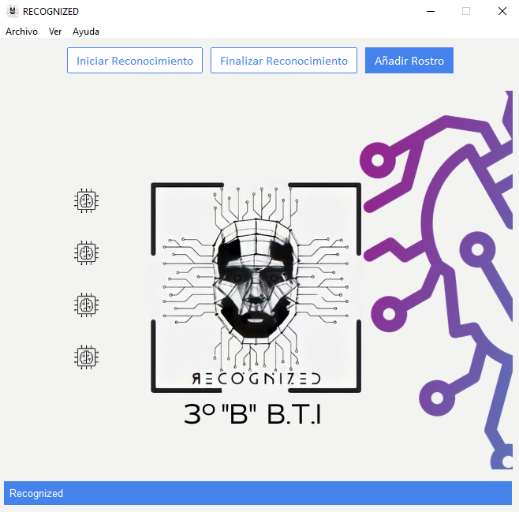
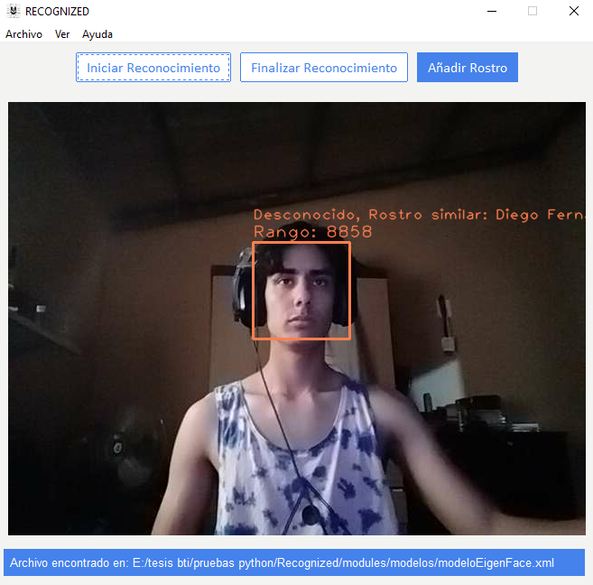
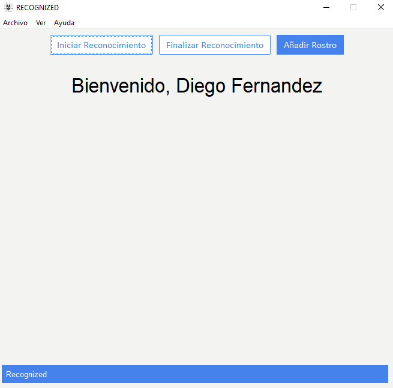
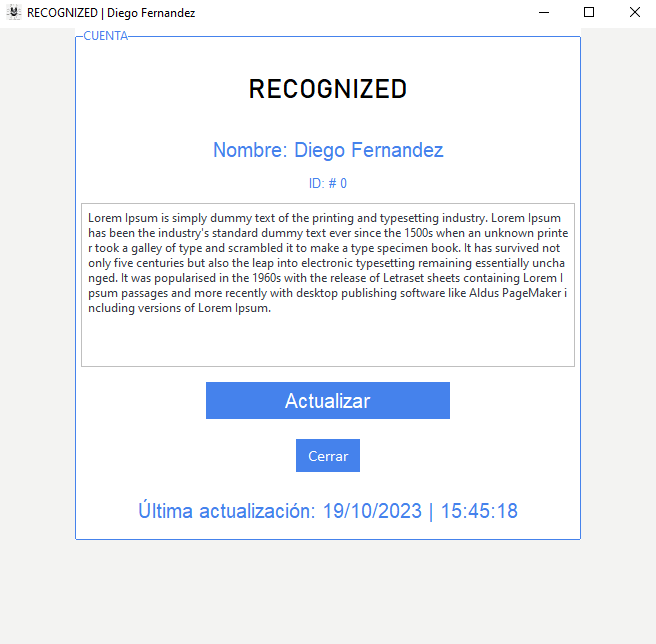
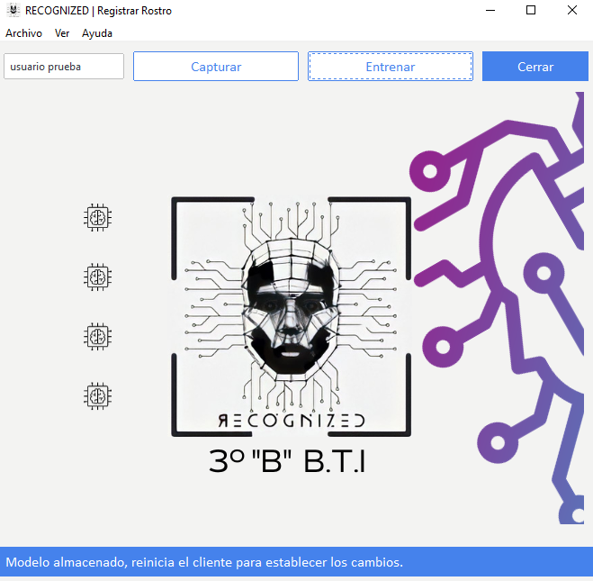
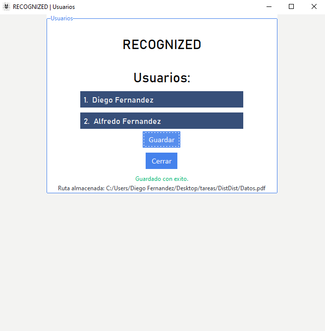
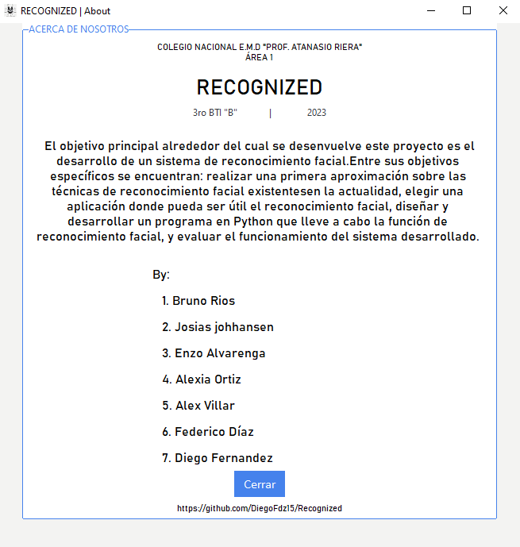
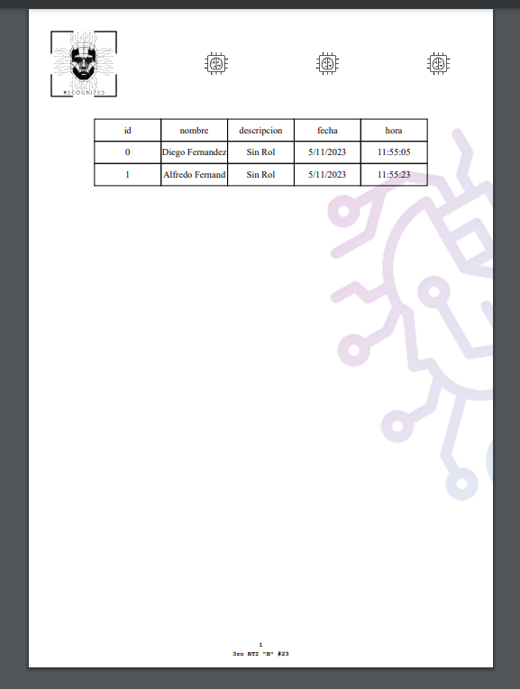

[](https://www.python.org/downloads/release/python-380/)

# RECOGNIZED 2023

### 🔥 Reconocimiento facial - BTI B - Area 1

***¿Qué es Recognized?***

*Recognized es una herramienta hecha en python que facilita el registro de una empresa o identidad mediante el uso de reconocimiento facial.*

***Planteamiento del problema***

*El desarrollo y evolución de la tecnología exige nuevas competencias en el desarrollo de sistemas inteligentes y automáticos tanto en la vida real como en la virtual, sobre todo con la aparición de nuevas tecnologías en el proceso de sistemas capaces de simular al ser humano.*

*Desde gestión de asistencia hasta usos en sistemas de seguridad, tanto para alumnos y docentes, como de igual manera a zonas de paso restringido así que, como alumnos del Bachillerato Técnico en Informática del Colegio Nacional E.M.D “Prof. Atanasio Riera” - Área 1, proponemos implementar una forma más eficaz y rápida para la recolección de estos datos.*

*Con* ***Recognized***  *podremos lograr este objetivo que facilitará una de las tantas tareas del instituto educativo.*

## Instalación

* Clonamos el repositorio de github.

````Bash
git clone https://github.com/DiegoFdz15/Recognized.git
````

* Nos movemos a la carpeta clonada.

````Bash
cd Recognized
````

* Instalamos los requerimientos necesarios para la ejecución del programa.

````Bash
pip install -r requirements.txt
````

* Ejecutamos el programa.

````Bash
python main.py
````

## Demostraciones

### Ventana principal



### Proceso de reconocimiento



### Reconocimiento completado



### Sesion inciada



### Añadir rostro



### Usuarios registrados



### Acerca de nosotros



### Pdf Generado



## Integrantes

* Bruno Rios
* Josias johannsen
* Enzo Alvarenga
* Alexia Ortiz
* Federico Díaz
* Diego Fernandez
